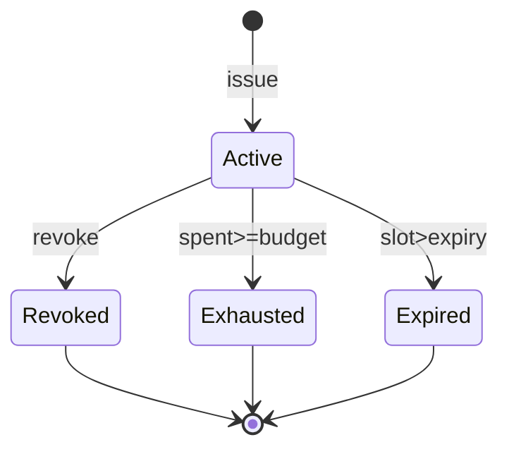
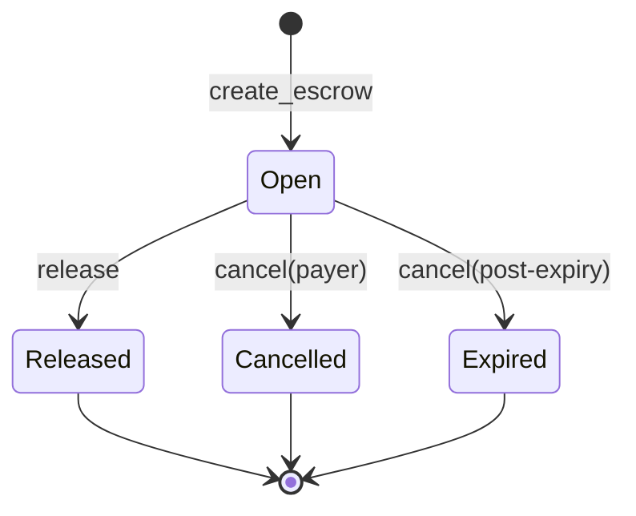
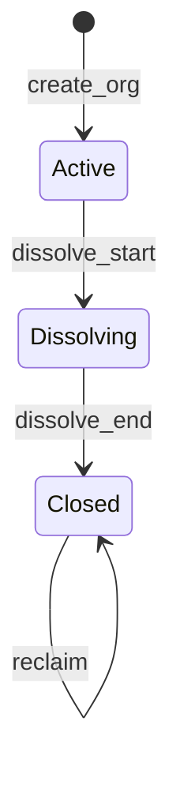

# Stoa: Advanced Negative E2E Testing Strategies for AEON

**Status:** Research + strategy (not full implementation)  
**Date:** 2026-08-09  
**Scope:** AEON Anchor program (16 ixs) + TypeScript Agent SDK  
**Audience:** Protocol engineers, security reviewers, agent-economy builders  

> **Stoa** (στοά): a covered walk where arguments are stress-tested in public.  
> This document is the permanent place to argue *what must fail*, *why*, and *how we prove it*.

---

## 0. Why negative e2e is the real product test

Happy-path e2e (`tests/aeon.ts`, `demos/agent-economy.ts`) proves AEON *can* move value under policy.  
Negative e2e proves AEON *refuses* every economically meaningful cheat:

| Layer | Happy path proves | Negative path proves |
|-------|-------------------|----------------------|
| Authority | Agent can spend under budget | Agent cannot overspend, re-enter, or forge parent |
| Escrow | Lock → release works | Wrong witness / status / payee cannot unlock |
| Org | Split / dissolve pays members | Non-admin, viewer, closed org cannot drain treasury |
| Tokens | Correct mint moves | Wrong mint / ATA / program cannot launder |
| Identity | Register once | Double-register, inactive agent, wrong CRI binding fail |

**Invariant:** every `AeonError` that protects funds or privilege must have ≥1 automated negative case that asserts **exact error code** (not “any failure”).

---

## 1. Current coverage gap (empirical)

### 1.1 What exists today

| Suite | Type | Cases | Negative depth |
|-------|------|-------|----------------|
| `tests/aeon.ts` | Happy e2e | 9 | 2 soft negatives (2nd register, depth>3) |
| `demos/agent-economy.ts` | Narrative happy | 9 | 0 intentional negatives |
| `client/__tests__/sdk.unit.ts` | Offline unit | 5 | PDA/plan only |

### 1.2 Error surface vs tests

- **~40** `AeonError` variants in `errors.rs`
- **~200+** `require!` / constraint sites across instructions
- **Densest gates:** `atomic_split` (39), `pay` (30), `create_escrow` (25), `issue_authority` (17)
- **Tested negatives today:** ~2–3 codes (`AgentAlreadyRegistered` path, `MaxDelegationDepth`)

**Coverage ratio (order of magnitude):** <10% of economically critical error codes have e2e ownership.

### 1.3 Industry baseline (research notes)

| Technique | Tooling | Fit for AEON |
|-----------|---------|--------------|
| Constraint audits | Manual + Trail of Bits Solana patterns | High — Option\<Authority\>, PDA seeds |
| Coverage-guided fuzz | [Trident](https://github.com/Ackee-Blockchain/trident), FuzzDelSol research | High for remaining_accounts / cascade |
| Property-based sequences | fast-check (TS) / proptest (Rust) | High for budget/share conservation |
| State-machine testing | Model-based (Authority/Escrow/Org status) | High — status machines are small |
| Differential testing | SDK vs raw Anchor accounts | Medium — catches client footguns |
| Chaos / reordering | Parallel txs same id | Medium — counter races |

Sources: Trident Anchor fuzzing, Trail of Bits Solana vuln classes (PDA, signer, CPI), Decurity Anchor constraint audit notes, Zealynx Solana security checklist.

---

## 2. Threat model for negative tests

Negative tests are not random asserts. Each case maps to an **attacker goal**:

```text
G1  Steal tokens from vault/treasury/ATA without authority
G2  Inflate spend capacity (budget, max_per_tx, soft parent)
G3  Bypass category / blocked-recipient policy
G4  Privilege escalate (member→admin effects, cross-agent authority)
G5  Break conservation (share_bps, treasury sum, spent after failed CPI)
G6  Replay / double-spend (re-release escrow, re-reclaim, re-register)
G7  Confuse PDAs (wrong seeds, wrong program, account substitution)
G8  Freeze or grief protocol (pause misuse, permanent Dissolving, stuck vault)
```

**Priority rule:** G1–G5 before G6–G8. Economic loss > griefing.

---

## 3. Taxonomy of advanced negative strategies

### S1 — Error-code matrix (foundational)

For each `(instruction, AeonError)` pair that is reachable, one test:

```text
setup → mutate one axis → invoke → expectError(code) → assert no state delta
```

**Axes of mutation:**

| Axis | Examples |
|------|----------|
| Signer | wrong wallet, missing signer, admin vs member |
| PDA | wrong id, wrong program, non-canonical bump account |
| Status | Revoked/Exhausted/Closed/Dissolving/Open |
| Amount | 0, budget+1, max_per_tx+1, u64::MAX |
| Policy | wrong category, blocked payee, empty ∩ |
| Relations | parent_id≠account, cross-agent parent, viewer as recipient |
| Mint/token | wrong mint, wrong owner ATA, Token-2022 vs classic mismatch |
| Lifecycle | double init, second register, re-release, reclaim while Active |

**Assertion template (mandatory):**

1. `expectAnchorError(tx, AeonError.X)` — exact code  
2. Snapshot critical accounts before/after — **byte-equal or field-equal**  
3. Token balances unchanged (for fail-closed money paths)

### S2 — State-machine exhaustive transitions

Model three FSMs; generate **illegal transitions** only:







**Illegal examples:**

- `pay` with `status ∈ {Revoked, Exhausted, Expired}`
- `release` on Cancelled / Released
- `deposit` / `org_split` / `join` on Closed
- `reclaim` on Active
- `revoke` on already Revoked (`AuthorityAlreadyRevoked`)

Automate with a tiny TS state model + table-driven cases (`tests/negative/fsm/*.ts`).

### S3 — Metamorphic / conservation properties

Properties that must hold **even when txs fail or partially sequence**:

| ID | Property | Oracle |
|----|----------|--------|
| P-budget | `spent' ∈ [spent, budget]` and only increases on **success** | fetch Authority pre/post |
| P-share | `Σ member.share_bps == org.total_share_bps ≤ 10000` after every join/set | fetch all members |
| P-treasury | `vault.amount` changes only via program CPI paths | getAccount |
| P-escrow | Open escrow ⇒ vault ≥ escrow.amount (no silent drain without status change) | vault vs meta |
| P-cri | CRI counters only increase on success paths | fetch Cri |
| P-depth | `child.depth == parent.depth+1 ≤ 3` | fetch both |
| P-policy | child categories ⊆ parent categories (when parent constrained) | field compare |
| P-atom | failed multi-leg (`atomic_split`) leaves all ATAs + spent unchanged | balances |

**Metamorphic relation examples:**

- `pay(a)` then `pay(b)` succeeds ⇒ `pay(a+b)` as single tx must respect same max_per_tx  
- `set_share` shrink then grow with same endpoints ⇒ total_share_bps invariant  
- `issue(child)` does not change `parent.spent` (document soft model) **or** test the hard model if product changes

### S4 — Adversarial account substitution (Solana-classic)

Pass **valid-looking wrong accounts**:

| Attack | Construction | Expected |
|--------|--------------|----------|
| PDA spoof | Same seeds, different program | Owner check fail |
| Identity swap | payee CRI of A with payee B | Unauthorized |
| Authority swap | Another agent’s Authority PDA | AuthorityAgentMismatch |
| Parent confuse-deputy | parent_id=0 but parent account Some | Unauthorized |
| Parent id mismatch | parent_id=2, account is authority #1 | ParentIdMismatch |
| Treasury bait | org_treasury of org B while organization is org A | seeds fail |
| ATA owner bait | payee_token owned by attacker | Unauthorized |
| Mint bait | random mint with same decimals | InvalidMint |
| Double-account | same pubkey in two mutable slots | Anchor/runtime reject or no-op safety |

### S5 — Temporal & clock attacks

| Case | Mechanism | Expected |
|------|-----------|----------|
| Authority expired | warp `Clock` / set expiry_slot in past | AuthorityExpired |
| Escrow timeout early release | CONDITION_TIMEOUT before expiry | EscrowConditionFailed |
| Escrow non-timeout past expiry | CONDITION_RECEIPT after expiry_slot | EscrowExpired |
| Cancel pre-expiry by non-payer | third party cancel | EscrowCancelUnauthorized |
| Cancel post-expiry by anyone | third party after warp | success → Expired |

**Localnet tool:** `context.warpToSlot` / Bankrun / LiteSVM clock control. Prefer **LiteSVM or Bankrun** for slot warps without full validator flakiness.

### S6 — Concurrency & counter races

Client-supplied ids (`authority_id`, `escrow_id`, `org_id` = counter+1):

| Case | Expected |
|------|----------|
| Two parallel issue with same id | exactly one succeeds; other AccountInUse |
| Stale id (counter+2 skip) | init may succeed orphan or fail policy — **define product rule** then test |
| Counter not advanced on failed issue | next successful id still counter+1 |

### S7 — Economic grief / soft-model exploitation

These may be **accepted product risks** — tests document behavior, not always “must fail”:

| Scenario | Soft model today | Negative/doc test |
|----------|------------------|-------------------|
| Two children each budget = parent.remaining | Both issue OK | `docs` + test `soft_overissue` labels **ACCEPTED** |
| Parent revoke leaves children Active | Soft cascade | test children still pay until explicit revoke |
| Dissolve omits member C (v0.1 2-account) | Residual → reclaim | test residual equals C’s theoretical share; flag product gap |
| Admin grants second Admin | By design | test escalate; optional harden later |

Tag each: `MUST_FAIL` | `MUST_SUCCEED_DOCUMENTED` | `PRODUCT_GAP`.

### S8 — Sequence chaos (multi-step adversarial scripts)

Long scripts that combine legal steps then one illegal:

1. **Exhaust-then-pay:** spend to budget-ε, then pay ε+1 → InsufficientBudget; spent unchanged  
2. **Revoke-then-escrow:** revoke root, create_escrow with that authority → AuthorityNotActive  
3. **Category-narrowing:** parent cats {compute}, child cats {research} → EmptyCategoryIntersection  
4. **Share-overflow dance:** join until total=10000, join +1 bps → ShareBpsExceedsMax  
5. **Escrow re-release:** release then release again → EscrowNotOpen  
6. **Closed-org deposit:** dissolve then deposit → OrgNotActive  
7. **Cross-agent issue:** agent B tries issue under A’s parent → AuthorityAgentMismatch  

### S9 — Fuzz / generative (advanced tier)

| Layer | Approach | When |
|-------|----------|------|
| Instruction arg fuzz | Trident (Rust) on pay/issue/atomic_split | After matrix ≥60% codes |
| Account meta fuzz | Random remaining_accounts / Option wiring | Cascade revoke, atomic_split |
| Sequence fuzz | Random legal ops from state model + inject illegal | Nightly CI |
| Differential | SDK method vs hand-built `.accounts({})` | Catch SDK bugs |

**Invariant oracles inside fuzzer:** P-budget, P-share, P-treasury (section S3).

### S10 — Token-2022 & extension hostility

| Case | Expected |
|------|----------|
| Transfer-hook mint that rejects | CPI fail; spent **not** committed (validate→transfer→commit) |
| Freeze authority freezes payer ATA | fail closed |
| Wrong token program id with classic mint | fail |
| Correct Token-2022 program + mint | success path (positive) |

Critical: **spent-before-transfer regression** — force CPI failure after would-be spent update; assert spent unchanged.

---

## 4. Priority matrix (what to build first)

Score = **Economic risk (1–5) × Reachability (1–5) × Untested (1–5)**  

| Rank | Cluster | Codes / behaviors | Score band | Phase |
|------|---------|-------------------|------------|-------|
| 1 | Pay / atomic_split budget & policy | ExceedsMaxPerTx, InsufficientBudget, CategoryNotAllowed, RecipientBlocked, AuthorityNotActive | 100–125 | **P0** |
| 2 | Authority hierarchy | MaxDelegationDepth, EmptyCategoryIntersection, ParentIdMismatch, AuthorityAgentMismatch, ParentRequired | 90–110 | **P0** |
| 3 | Escrow lifecycle | EscrowNotOpen, EscrowConditionFailed, EscrowCancelUnauthorized, EscrowExpired | 80–100 | **P0** |
| 4 | Org conservation & authz | ShareBpsExceedsMax, OrgNotActive, OrgNotClosed, Unauthorized (role), TreasuryConservation | 80–100 | **P0** |
| 5 | Account substitution / mint | InvalidMint, Unauthorized ATA, wrong PDA | 70–90 | **P1** |
| 6 | Temporal | AuthorityExpired, timeout conditions | 60–80 | **P1** |
| 7 | Cascade revoke | InvalidCascadeChild, AccountDidNotSerialize regressions | 50–70 | **P1** |
| 8 | Soft-model documentation tests | soft over-issue, residual dissolve | 40–60 | **P2** |
| 9 | Fuzz / Trident | generative | continuous | **P2 — DONE** ([TRIDENT_P2.md](./TRIDENT_P2.md)) |


---

## 5. Concrete P0 case catalog (implementable)

Naming: `NEG-<domain>-<nnn>`.

### 5.1 Authority / issue

| ID | Setup | Action | Expect |
|----|-------|--------|--------|
| NEG-AUTH-001 | root depth chain 0..3 | issue depth 4 | `MaxDelegationDepth` |
| NEG-AUTH-002 | parent Active, child cats disjoint | issue with empty ∩ | `EmptyCategoryIntersection` |
| NEG-AUTH-003 | parent remaining R | issue budget R+1 | `ChildBudgetExceedsParent` |
| NEG-AUTH-004 | parent Revoked | issue child | `ParentNotActive` |
| NEG-AUTH-005 | parent_id≠0, parent account null | issue | `ParentRequired` |
| NEG-AUTH-006 | parent_id=0, parent account Some | issue | `Unauthorized` |
| NEG-AUTH-007 | parent belongs to agent B | agent A issue under it | `AuthorityAgentMismatch` |
| NEG-AUTH-008 | parent_id=2, pass authority #1 | issue | `ParentIdMismatch` |
| NEG-AUTH-009 | categories.len()>8 | issue | `InvalidCategoryCount` |
| NEG-AUTH-010 | inactive agent | issue | `AgentNotActive` |

### 5.2 Pay / spend

| ID | Setup | Action | Expect |
|----|-------|--------|--------|
| NEG-PAY-001 | auth max_per_tx=M | pay M+1 | `ExceedsMaxPerTx` |
| NEG-PAY-002 | spent=budget-1 | pay 2 | `InsufficientBudget` |
| NEG-PAY-003 | category not in set | pay | `CategoryNotAllowed` |
| NEG-PAY-004 | payee blocked | pay | `RecipientBlocked` |
| NEG-PAY-005 | authority Revoked | pay | `AuthorityNotActive` |
| NEG-PAY-006 | authority_id≠0, authority=None | pay | `AuthorityRequired` |
| NEG-PAY-007 | authority_id=0, authority=Some | pay | `Unauthorized` |
| NEG-PAY-008 | self-pay | pay | `Unauthorized` |
| NEG-PAY-009 | amount=0 | pay | `InvalidAmount` |
| NEG-PAY-010 | wrong mint ATA | pay | `InvalidMint` |
| NEG-PAY-011 | payee_token owner ≠ payee | pay | `Unauthorized` |
| NEG-PAY-012 | Authority PDA for wrong id | pay | `Unauthorized` |
| NEG-PAY-013 | other agent’s authority | pay | `AuthorityAgentMismatch` |
| NEG-PAY-014 | expired authority | pay | `AuthorityExpired` |
| NEG-PAY-015 | require_min_reserve breach | pay | `InsufficientBudget` |
| NEG-PAY-016 | CPI fail (empty ATA) | pay | fail + **spent unchanged** |

### 5.3 Escrow

| ID | Setup | Action | Expect |
|----|-------|--------|--------|
| NEG-ESC-001 | released escrow | release again | `EscrowNotOpen` |
| NEG-ESC-002 | open, wrong witness | release receipt | `EscrowConditionFailed` |
| NEG-ESC-003 | timeout, before expiry | release | `EscrowConditionFailed` |
| NEG-ESC-004 | non-timeout past expiry | release | `EscrowExpired` |
| NEG-ESC-005 | non-payer cancel pre-expiry | cancel | `EscrowCancelUnauthorized` |
| NEG-ESC-006 | oracle condition | release | `EscrowConditionFailed` |
| NEG-ESC-007 | wrong escrow id account | release | `EscrowIdMismatch` |
| NEG-ESC-008 | payee_token not payee | release | `Unauthorized` |
| NEG-ESC-009 | revoked authority create | create_escrow | `AuthorityNotActive` |
| NEG-ESC-010 | escrow_id ≠ counter+1 | create | `EscrowIdMismatch` |

### 5.4 Org

| ID | Setup | Action | Expect |
|----|-------|--------|--------|
| NEG-ORG-001 | total=10000 | join +1 bps | `ShareBpsExceedsMax` |
| NEG-ORG-002 | share_bps>10000 | join | `InvalidShareBps` |
| NEG-ORG-003 | non-admin join | join | `Unauthorized` |
| NEG-ORG-004 | viewer as org_split recipient | split | `Unauthorized` |
| NEG-ORG-005 | closed org deposit | deposit | `OrgNotActive` |
| NEG-ORG-006 | active org reclaim | reclaim | `OrgNotClosed` |
| NEG-ORG-007 | non-member deposit | deposit | `Unauthorized` |
| NEG-ORG-008 | split amount > treasury | split | `TreasuryConservation` |
| NEG-ORG-009 | set_share intermediate overflow | grow before shrink | `ShareBpsExceedsMax` |
| NEG-ORG-010 | unregistered creator | create_org | `AgentNotActive` / seeds fail |
| NEG-ORG-011 | member role only try dissolve | dissolve | `Unauthorized` |
| NEG-ORG-012 | wrong destination mint reclaim | reclaim | `InvalidMint` |

### 5.5 Revoke

| ID | Setup | Action | Expect |
|----|-------|--------|--------|
| NEG-REV-001 | already revoked | revoke | `AuthorityAlreadyRevoked` |
| NEG-REV-002 | other agent’s auth | revoke | `AuthorityAgentMismatch` |
| NEG-REV-003 | cascade non-child | revoke+remaining | `InvalidCascadeChild` |
| NEG-REV-004 | cascade non-writable | revoke+remaining | `InvalidCascadeChild` |
| NEG-REV-005 | cascade wrong owner | revoke+remaining | `InvalidCascadeChild` |

---

## 6. Implementation architecture

### 6.1 Layout proposal

```text
aeon-program/
├── tests/
│   ├── aeon.ts                    # happy e2e (existing)
│   ├── negative/
│   │   ├── helpers.ts             # expectError, snap, fund, warp
│   │   ├── auth.negative.ts       # NEG-AUTH-*
│   │   ├── pay.negative.ts        # NEG-PAY-*
│   │   ├── escrow.negative.ts     # NEG-ESC-*
│   │   ├── org.negative.ts        # NEG-ORG-*
│   │   ├── revoke.negative.ts     # NEG-REV-*
│   │   ├── fsm.negative.ts        # S2 illegal transitions
│   │   └── conservation.negative.ts # S3 properties
│   └── fixtures/
│       └── economy.ts             # shared bootstrap (mint, 3 agents, ATAs)
├── docs/stoa/
│   ├── NEGATIVE_E2E_STRATEGIES.md # this file
│   ├── CASE_CATALOG.md            # living checklist (IDs + status)
│   └── COVERAGE.md                # code × test matrix (generated later)
└── trident-tests/                 # Trident 0.12 workspace (P2 — remaining_accounts_p2)

```

### 6.2 Helper contract (`helpers.ts`)

```ts
async function expectAeonError(p: Promise<unknown>, code: string): Promise<void>
async function snapAuthority(id): Promise<AuthoritySnapshot>
async function assertUnchanged(before, after): Promise<void>
async function fundAgent(kp, mint, amount): Promise<Ata>
async function bootstrapEconomy(): Promise<Fixture>  // config+mint+A/B/C registered
```

**Error matching:** parse Anchor logs for `Error Code: Foo` / error number from IDL — do not match message strings alone.

### 6.3 Runner isolation

Same pattern as demo:

```json
"test:negative": "bash scripts/run-negative.sh"
```

Fresh validator per suite avoids config PDA collisions with happy e2e.

### 6.4 SDK vs raw

- Prefer **`AeonClient`** for setup  
- Prefer **raw `program.methods`** for account-substitution attacks (SDK hides metas)  
- Dual-run critical cases: SDK path + raw path (S9 differential)

---

## 7. Measurement & “done” criteria

| Metric | P0 target | P1 target |
|--------|-----------|-----------|
| `AeonError` codes with ≥1 e2e owner | ≥25 / ~40 | ≥35 / ~40 |
| Money-path codes (pay/escrow/org/auth) | 100% | 100% |
| Fail-closed spent/treasury checks | all P0 money fails | + Token-2022 |
| Flake rate | <1% on localnet CI | <0.5% |
| Time budget | <90s for P0 suite | <3 min full negative |

**Exit criterion for P0:** every G1–G5 attacker goal has ≥1 red-team script that fails closed with exact code + balance oracle.

---

## 8. Anti-patterns (do not do)

1. **`expect(failed).to.equal(true)`** without code — hides regressions that fail for the wrong reason  
2. **Shared mutable fixture across negative files** without isolation — cascading false fails  
3. **Only unit-testing `require!` in Rust** — misses account constraint / CPI / runtime  
4. **Testing SDK validation instead of on-chain** — attackers skip the SDK  
5. **Asserting log substrings** as sole oracle — brittle across Anchor versions  
6. **Ignoring soft-model cases** — either MUST_FAIL or MUST_SUCCEED_DOCUMENTED, never silent  

---

## 9. Brainstorm backlog (ideas not yet in P0)

| Idea | Value | Cost | Notes |
|------|-------|------|-------|
| Visual state diagrams → generated illegal edges | High | Med | codegen from mermaid/YAML |
| Mutation testing of tests (delete require, see test fail) | Very high | High | proves tests have teeth |
| Mainnet-fork adversarial replay | Med | High | after devnet |
| Agent-sim multi-wallet random walk (24h) | High | Med | economy demo fuzzer |
| Formal model (Quint/TLA+) of budget+share | High | High | optional research track |
| Compare Python SDK vs TS SDK differentials | Med | Low | if Python path remains |
| “Refund” economic tests (cancel restores exact lamports+tokens) | High | Low | add to P0 escrow |
| Pause switch negative (if admin pause ix exists later) | Med | Low | config.paused already gated |

---

## 10. Recommended next execution (tagged)

| # | Tag | Task | Outcome |
|---|-----|------|---------|
| 1 | **BUILD** | `tests/negative/helpers.ts` + fixture bootstrap | shared harness |
| 2 | **BUILD** | P0 suites: AUTH + PAY + ESC + ORG + REV (~50 cases) | exact error + balance oracles |
| 3 | **BUILD** | `docs/stoa/CASE_CATALOG.md` checklist with pass/fail CI badge | living coverage |
| 4 | **BUILD** | `npm run test:negative` isolation script | CI entrypoint |
| 5 | **HEAVY** | Review spent-before-transfer under forced CPI fail | security closeout |
| 6 | **BUILD** | P1 temporal + substitution + Token-2022 hostility | depth |
| 7 | **BUILD** | Trident fuzz skeleton for pay/issue | **DONE** — `trident-tests/remaining_accounts_p2` ([TRIDENT_P2.md](./TRIDENT_P2.md)) |
| 8 | **BUILD** | Extended devnet demo (escrow → org → dissolve) | product surface |
| 9 | **HEAVY** | Transfer-hook reject path (Token-2022) | CPI hostility |


---

## 11. One-line doctrine

> **Every AEON failure mode that can lose money or mint privilege must be named, numbered, and forced to fail the same way twice: once in the program, once in CI.**

---

## Appendix A — Error code index (for ownership)

| Code | Primary ixs | P0 owner file |
|------|-------------|---------------|
| Paused | many | pay.negative / auth |
| Unauthorized | many | pay/org |
| AgentAlreadyRegistered | register | auth (exists happy) |
| AgentNotActive | issue/create_org | auth |
| InvalidBudget | issue | auth |
| MaxDelegationDepth | issue | auth (partial exists) |
| ParentNotActive | issue | auth |
| ChildBudgetExceedsParent | issue | auth |
| AuthorityNotActive | pay/escrow | pay |
| AuthorityExpired | pay | pay |
| InvalidCategoryCount | issue | auth |
| ParentRequired | issue | auth |
| ParentIdMismatch | issue | auth |
| InvalidAmount | pay/escrow/org | pay |
| ExceedsMaxPerTx | pay | pay |
| ExceedsMaxTotal | pay | pay |
| InsufficientBudget | pay | pay |
| CategoryNotAllowed | pay | pay |
| RecipientBlocked | pay | pay |
| AuthorityRequired | pay | pay |
| AuthorityAgentMismatch | pay/issue | pay/auth |
| EmptyCategoryIntersection | issue | auth |
| InvalidMint | pay/org/escrow | pay |
| AuthorityAlreadyRevoked | revoke | revoke |
| InvalidCascadeChild | revoke | revoke |
| EscrowNotOpen | release/cancel | escrow |
| EscrowConditionFailed | release | escrow |
| EscrowExpired | release | escrow |
| EscrowCancelUnauthorized | cancel | escrow |
| EscrowIdMismatch | create/release | escrow |
| OrgNotActive | deposit/split/join | org |
| TreasuryConservation | split/dissolve | org |
| InvalidShareBps | join/set | org |
| ShareBpsExceedsMax | join/set | org |
| OrgNotClosed | reclaim | org |

---

## Appendix B — Research references (external)

- Trident: fuzz testing Anchor programs (Ackee Blockchain)  
- Trail of Bits Solana vulnerability classes (PDA, signer, CPI)  
- Decurity: Auditing Solana Anchor constraints (2025)  
- Zealynx Solana security checklist (PDAs, Token-2022, overflow)  
- FuzzDelSol (arXiv): binary-only Solana fuzzing architecture  

*End of Stoa entry. Update CASE_CATALOG when P0 implementation lands.*
